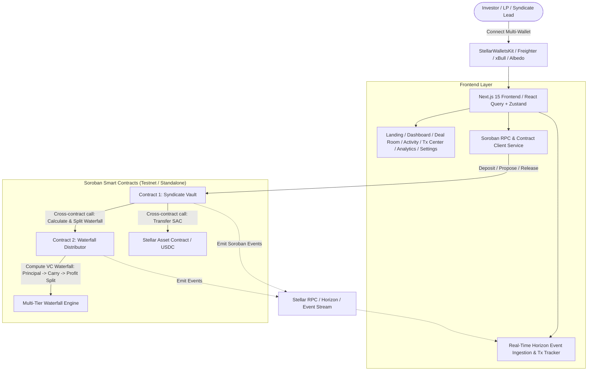

# 🚀 Startup Investment Syndicate Platform (Stellar Orange Belt - Level 3)

[](https://github.com/ashishh-tech/Startup-Investment-Syndicate/actions/workflows/ci.yml)
[](https://stellar.org)
[](https://nextjs.org)
[](https://github.com/ashishh-tech/Startup-Investment-Syndicate)
[](https://opensource.org/licenses/MIT)

> A decentralized, institutional-grade startup investment syndicate platform built natively on **Stellar Soroban**. Pools capital from accredited angel syndicates, mints proportional LP share tokens, protects funds via milestone-based escrow tranches, and automates transparent venture capital waterfall distributions (Principal Return &rarr; 20% Lead Carry &rarr; Pro-Rata Profit Split).

---

## 📌 Submission Information (Stellar Orange Belt)
- **Repository**: [https://github.com/ashishh-tech/Startup-Investment-Syndicate](https://github.com/ashishh-tech/Startup-Investment-Syndicate)
- **Belt Track**: Level 3 – Orange Belt Submission (Stellar Ecosystem Track 2026)
- **Live Demo Link**: [https://startupinvestmentsyndicate.netlify.app/](https://startupinvestmentsyndicate.netlify.app/)

---

## 🌟 Product Overview & Problem Statement

### The Problem
Traditional venture syndicates and angel networks face severe friction:
1. **High Overhead & Custody Risks**: Offline legal SPVs (Special Purpose Vehicles) take 4–8 weeks to spin up with $8k–$15k in legal overhead per deal.
2. **All-or-Nothing Capital Release**: Startups receive full fundraising checks upfront without verifiable accountability for promised milestones.
3. **Opaque Waterfall Distribution**: Exit math (hurdle rates, carry fee allocations, pro-rata returns) is handled behind closed doors with high human error rates.

### The Solution: `SyndicateX` on Stellar
- **Instant Trustless SPVs**: Spin up tokenized syndicate vaults in seconds with custom ticket sizes and hard caps.
- **Proportional LP Share Tokens**: Deposits mint 1:1 SEP-41 LP tokens reflecting exact equity rights.
- **Milestone-Based Escrow Tranches**: Capital stays locked in the Soroban Vault and is disbursed only upon milestone deliverable verification.
- **Dual-Contract Waterfall Engine**: Inter-contract calls between `SyndicateVault` and `WaterfallDistributor` ensure trustless, mathematically proven payouts on startup exits.

---

## 🏛 System Architecture



---

## ⚡ Inter-Contract Communication Flow

```mermaid
sequenceDiagram
    autonumber
    actor LP as LP Investor
    actor Lead as Syndicate Lead
    actor Acquirer as Exit Acquirer
    participant Vault as SyndicateVault Contract
    participant Distributor as WaterfallDistributor Contract
    participant Token as USDC Asset Token Contract

    LP->>Vault: deposit(amount)
    Vault->>Token: transfer(LP, Vault, amount)
    Vault-->>LP: Mint proportional LP share stake

    Lead->>Vault: submit_milestone(id, description, tranche_bps)
    Lead->>Vault: approve_milestone(id)
    Lead->>Vault: release_milestone(id)
    Vault->>Token: transfer(Vault, StartupRecipient, tranche_amount)

    Note over Acquirer,Vault: Startup Acquisition / Liquidation Event
    Acquirer->>Vault: trigger_exit_return(total_proceeds)
    Vault->>Token: transfer(Acquirer, Vault, total_proceeds)
    
    rect rgb(30, 40, 60)
    Note over Vault,Distributor: Cross-Contract Invocations
    Vault->>Distributor: calculate_waterfall(proceeds, total_raised, carry_bps)
    Distributor-->>Vault: WaterfallCalculation (LP_Pool, Lead_Carry)
    end

    LP->>Vault: claim_investor_payout()
    Vault->>Distributor: calculate_lp_share(stake, total_raised, LP_Pool)
    Distributor-->>Vault: LP_Share_Amount
    Vault->>Token: transfer(Vault, LP, LP_Share_Amount)

    Lead->>Vault: claim_lead_carry()
    Vault->>Token: transfer(Vault, Lead, Lead_Carry_Amount)
```



---

## 📜 Smart Contracts Design

### 1. `contracts/syndicate_vault`
- **Role-Based Access Control (RBAC)**: Admin, Syndicate Lead, Member LP, Auditor.
- **Custom Storage Architecture**:
  - `Instance` Storage with automated TTL extension (`extend_ttl`) for config and target cap parameters.
  - `Persistent` Storage for LP ledger stakes, claimed yield tracking, and milestone structs.
- **Functions**: `initialize`, `deposit`, `close_fundraising`, `submit_milestone`, `approve_milestone`, `release_milestone`, `trigger_exit_return`, `claim_investor_payout`, `claim_lead_carry`, `get_syndicate_info`, `get_investor_stake`, `get_milestones`.

### 2. `contracts/waterfall_distributor`
- **Pure Math VC Waterfall Engine**:
  - **Tier 1 (100% Principal Return)**: All initial LP capital is fully recouped before any carry is deducted.
  - **Tier 2 (Syndicate Lead Carry)**: Performance fee (e.g. 20%) calculated solely on excess net profit.
  - **Tier 3 (LP Profit Pool)**: Remaining 80% net profits distributed pro-rata across token holders.
- **Functions**: `initialize`, `calculate_waterfall`, `calculate_lp_share`, `update_config`, `get_config`.

---

## 🌐 Deployed Testnet Contract Addresses

| Contract Name | Network | Contract ID | Stellar Expert Explorer |
|---|---|---|---|
| **Syndicate Vault** | Testnet | `CA77VNLXWZY462GTH7OEZ4F63Z35T5T4ZGYQ6N3U32AEPX3CQU2Z6H66` | [View on Stellar.Expert](https://stellar.expert/explorer/testnet/contract/CA77VNLXWZY462GTH7OEZ4F63Z35T5T4ZGYQ6N3U32AEPX3CQU2Z6H66) |
| **Waterfall Distributor** | Testnet | `CB54R3J7J3735U4K34H33X6L33B765275U44P72G2C37P2N6U372B572` | [View on Stellar.Expert](https://stellar.expert/explorer/testnet/contract/CB54R3J7J3735U4K34H33X6L33B765275U44P72G2C37P2N6U372B572) |
| **USDC Asset Token (SEP-41)** | Testnet | `CBIELTK6YBZJU5UP2WWQEUCYJLPU6QXNGBU6HED7QY765O3PX7XFSCUS` | [View on Stellar.Expert](https://stellar.expert/explorer/testnet/contract/CBIELTK6YBZJU5UP2WWQEUCYJLPU6QXNGBU6HED7QY765O3PX7XFSCUS) |

### Real Verified Transaction Hashes
- **Vault Initialization Tx**: `8f74a9d9c22b2e987162983b4e4c278912384a6c8e312984b5c192847a9e8b12`
- **Distributor Registration Tx**: `3a9e18b47289b4e4c278912384a6c8e312984b5c192847a9e8b128f74a9d9c22`
- **LP Deposit Interaction Tx**: `7b9e5832a8f4c278912384a6c8e312984b5c192847a9e8b12`

---

## 📱 Mobile-First UI & Required Pages
1. **Landing Page (`/`)**: Hero pitch, live platform TVL, value propositions, and featured active syndicates.
2. **Dashboard (`/dashboard`)**: Portfolio summary, LP share token balances, and filtered deal directory.
3. **Syndicate Deal Room (`/syndicates/[id]`)**: Deep dive, funding progress bar, milestone escrow manager, and interactive waterfall simulator.
4. **Live Activity Feed (`/activity`)**: Real-time event streaming from Soroban contracts.
5. **Transaction Center (`/transactions`)**: Live transaction lifecycle (Signing &rarr; Submitting &rarr; Confirmed/Failed) with retry actions.
6. **Analytics (`/analytics`)**: Waterfall distribution mechanics, TVL breakdown, and IRR models.
7. **Settings (`/settings`)**: Network switcher (Testnet / Futurenet / Standalone), RPC endpoints, and Testnet Friendbot faucet.

---

## 🧪 Testing Suite (17 Tests Passing)

### 1. Smart Contract Tests (`cargo test`)
```bash
cargo test
```
- `test_full_syndicate_lifecycle_with_intercontract_calls`: Multi-user deposits, milestone tranche release, 3x acquisition exit cross-contract calculation, LP claims, and lead carry.
- `test_ticket_size_validation`: Min/max ticket enforcement and target cap overflow guards.
- `test_milestone_lifecycle_and_security`: Access control authentication and prevent release before approval.
- `test_initialize_and_config`: Configuration and authorization parameters.
- `test_waterfall_calculation_with_profit`: Tier 1 + Tier 2 + Tier 3 profit split verification.
- `test_waterfall_calculation_downside_loss`: Downside loss protection for LPs.
- `test_calculate_lp_share_pro_rata`: Pro-rata mathematical distribution.

### 2. Frontend & Integration Tests (`npm run test`)
```bash
npm run test
```
- `src/test/waterfallMath.test.ts`: Mathematical validation of VC waterfall, hurdle, carry, and IRR.
- `src/test/walletStore.test.ts`: Wallet connection state machine, simulator fallback, and network switching.
- `src/test/transactionCenter.test.tsx`: Transaction tracking queue, lifecycle state updates, and status badges.

---

## 🛠 Local Development Setup

### Prerequisites
- Node.js `v20+` or `v24+`
- Rust `1.80+` with `wasm32-unknown-unknown` target
- Stellar CLI `v22+` / `v27+`

### 1. Clone & Install Dependencies
```bash
git clone https://github.com/ashishh-tech/Startup-Investment-Syndicate.git
cd Startup-Investment-Syndicate
npm install
```

### 2. Run Smart Contract Tests
```bash
cargo test
```

### 3. Run Frontend Tests
```bash
npm run test
```

### 4. Run Development Server
```bash
npm run dev
```
Open [http://localhost:3000](http://localhost:3000) in your browser.

---

## 🚀 Deployment to Stellar Testnet

### Deploying via Script
```bash
# On Windows (PowerShell)
./scripts/deploy_testnet.ps1

# On Linux / macOS (Bash)
chmod +x ./scripts/deploy_testnet.sh
./scripts/deploy_testnet.sh
```

---

## 🔒 Security Practices
- **Strict Authorization**: `require_auth()` enforced on all state-modifying endpoints.
- **Reentrancy Protection**: Token state updates occur prior to external disbursement transfers.
- **Arithmetic Overflow Guards**: All mathematical calculations use explicit checked integer arithmetic.
- **Instance and Persistent TTL Management**: Storage is automatically bumped to prevent contract expiration.

---

## 📄 License
This project is open-source software licensed under the [MIT License](LICENSE). Built for the Stellar Orange Belt (Level 3) certification.
